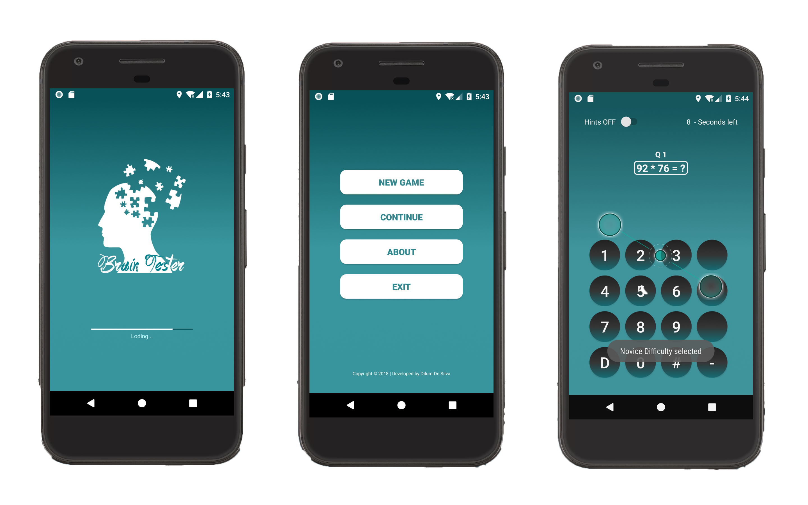
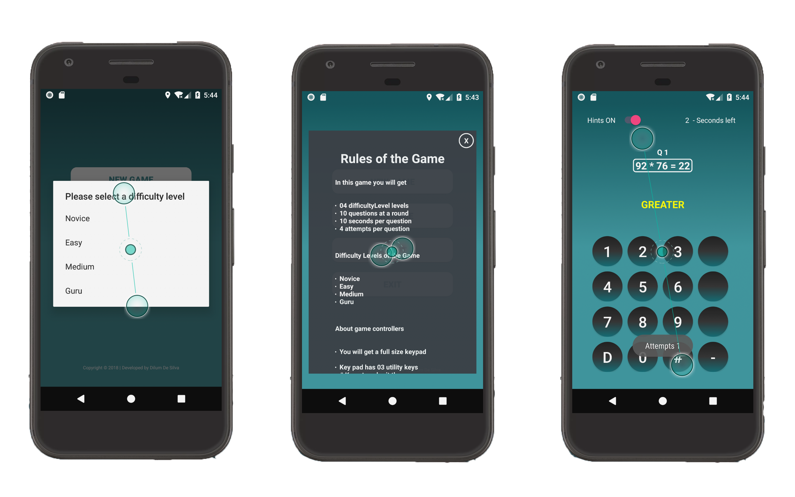

# Brain-Tester
Brain Tester android application is a **basic brain training game**, which will be asking the user to calculate the answer to various simple arithmetic expressions depending on the user selected game difficulty level from one of the main screens. As well as this one of my very first projects which I completed during my second year(Level 05) mobile applicaation development module at IIT.

Following picture is showing the main screens of this **Brain-Tester** game.

## Main Screens of Brain-Tester Game

The first screen shows the **splash screen** of my game and I added a progress bar and logo to make it looks better. Second screen presents the user 4 buttons labelled **New Game, Continue, About and Exit** as the main game menu screen.

For further user can perform following tasks using the menu screen(Second Screen).
* Clicking on the **New Game button**, starts a new game for the user.
* Clicking on the **Continue button**, a previously started game is resumed. The game resumes from exactly the same point that it was left before.
* Clicking on the **About button**, it presents the user with a popup window which describes the rules of the game.
* Clicking on the **Exit button**, terminates the application.

## Featured Screens of Brain-Tester Game

The first screen of the above picture presents the four levels of game difficulty, **Novice, Easy, Medium, Guru**. Clicking on each one of them sets the maximum number of terms involved in the arithmetic expression that the user needs to calculate such as, 

* **The Novice level** corresponds to an arithmetic expression involving exactly 2 integers.
* **Easy level** corresponds to an arithmetic expression with maximum 3 terms (it can contain 2 or 3 integers).
* **The Medium level** corresponds to an arithmetic expression with maximum 4 terms.
* **The Guru level**, hardest level corresponds to an arithmetic expression with maximum 6 terms and minimum 4 terms.

After the user sets the difficulty level, by clicking on one of the 4 levels, the user is presented with the main game screen which contains a **random (not fixed or hardcoded but randomly generated by the program itself) arithmetic expression among integers**, based on the difficulty level he/she has chosen. The arithmetic expression includes random mixed operations utilising addition, subtrac- tion, multiplication and division. The third screen of the featured screens picture shows the main game screen of Brain-Tester game.

### Game Screen
Besides the arithmetic expression, the game screen also contains 13 buttons corresponding to numbers 0 to 9, the DEL key, the # key and the minus − key. Once the user starts typing the correct answer by using the game screen buttons, the question mark ? will disappear and replaced with the numbers that the user types.

**Functions which I developed in the game screen**

* A digit appears on the screen as soon as the user types each single digit, by using the on screen buttons, (i.e. the answer appears digit by digit and NOT just when the user types the whole answer).

* If the user makes a mistake he/she can delete the last digit typed by pressing the DEL button. DEL deletes all digits typed one by one.

* The user can indicates that the full answer is completed by hitting the # button. 

* I have placed a minus - button in the keypad to enter minus values as the answer.

* User has the option to turn on hints functions from the top left conrner while playing the game. If the hints option is “on” then he/she will be given 4 attempts per question (arithmetic expression), in case his first, second and third attempts to answer are incorrect. Every time that the user gives an incorrect answer when this option is “on” the application wil be displaying “greater” (if the user’s answer is less than the correct answer) and “less” (if the user’s answer is greater than the correct answer).

* I have Extend the application by providing a countdown timer, counting from 10 down to 1, every tick occurring after 1 second exactly. The countdown timer is displayed in the main screen of the game, as shown in top right corener of the game screen. As soon as the counter reaches the value of 0, the next arithmetic expression is presented to the user (in this case the user does not need to press the # to move to the next question). However, if the user presses the # button before the counter reaches 0, the counter stops, the game displays whether the answer is correct or incorrect and a subsequent press of # moves to the next question.

## How to score in Brain-Tester

In the end of each game (after 10 arithmetic expressions), the user will be displayed with a score which the sum of the points scored in each question. The score will take into account how fast the user answered the question. It will be calculated based on the following:

* 0 marks will be assign for each incorrect guess.
* **[100/ 10 - time remaining]** marks for each correct guess. time remaining is the value of the countdown timer when the user pressed the # button to submit the answer. For example, if the user answered a question correctly and the time remaining was 4 secs, then the points received for the question are 100/(10-4) = 100/6=17 points. Points are rounded to the closest integer value. We assume that the user usually cannot answer in less than 0 secs in order to avoid a denominator of 0. If the user answers a question with 10 secs remaining, then the points awarded are 100 (for a correct guess).

## Technology behind Brain-Tester

1. Development IDE - Android Studio 3.0.1
2. Main development language - Java & XML
3. Teted AVD s - Google Pixel / Nexus 5X
4. Tested API Level - API 26 / API 27

